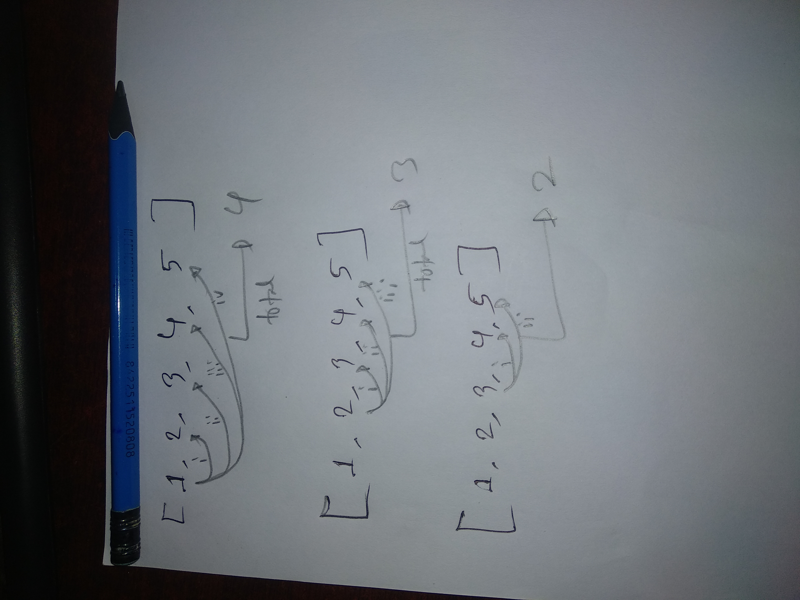

I solved this in two way.
 1. First way, the code take too much time for solving the 54 cases of example.
 2. Second way, I use the hash functions to solve the problem.

# First way:
It takes one element and iterate to the other element of the list to which together sum is equal to the target. After the first element, the second will iterate the other element of the list not the first one. To do this, I take the extra variable 'i' for positioning the next element to iterate to the other elements of the list.


To calcute how much steps it will iterate is measured by this loop where q is the length of the list.
```bash
    for j in range(1,q):
      p=p+j
```
It takes too much time for looking all the elements one after another. For retriving it, I use hash function.

# Second way:
A hash function is any function that can be used to map data of arbitrary size to fixed-size values. The values returned by a hash function are called hash values, hash codes, digests, or simply hashes. [source](https://en.wikipedia.org/wiki/Hash_function)
Without checking all element, I am just calculating the difference value of one element with the target and check which element is equal to the difference value. In the problem, it also say the summation of same element will not equal to target. So I calucate the difference value first then put the element in the Hash function. 

